# Olist Brazilian E-Commerce Analytics

## End-to-End Data Analytics Portfolio Project

An end-to-end data analytics project using the **Brazilian E-Commerce Public Dataset by Olist**. The project analyzes sales, customers, products, sellers, payments, delivery performance, and customer satisfaction to identify meaningful business insights and support data-driven decision-making.

---

## 📌 Business Objective

To analyze the sales, customer, product, seller, payment, delivery, and customer satisfaction data of the Olist Brazilian e-commerce marketplace and identify meaningful business insights that can support better business decision-making.

---

## 🎯 Project Objectives

- Analyze overall sales and order performance
- Understand customer purchasing and retention patterns
- Analyze product category and seller performance
- Examine payment methods and installment behavior
- Evaluate delivery and logistics performance
- Analyze customer satisfaction and review patterns
- Develop actionable business recommendations

---

## 📊 Dataset

**Dataset:** Brazilian E-Commerce Public Dataset by Olist  
**Source:** Kaggle

The dataset contains information about:

- Customers
- Orders
- Order items
- Products
- Sellers
- Payments
- Reviews
- Geolocation
- Product category translations

The original dataset files are **not included in this repository**.

See [`data/dataset_information.txt`](data/dataset_information.txt) for dataset details.

---

## 🛠️ Tools & Technologies

| Tool | Purpose |
|---|---|
| Python | Data cleaning, EDA and analysis |
| Jupyter Notebook | Analytical workflow |
| PostgreSQL | Database and SQL analysis |
| SQL | Business analysis and validation |
| Microsoft Excel | Data analysis and validation |
| Power BI | Interactive dashboard and visualization |
| DAX | Power BI measures and calculations |
| GitHub | Project documentation and version control |

---

## 🔄 Project Workflow

```text
Business Understanding
        ↓
Data Understanding
        ↓
Data Quality Assessment
        ↓
Python / Jupyter Analysis
        ↓
PostgreSQL / SQL Analysis
        ↓
Excel Analysis
        ↓
Power BI Dashboard
        ↓
Business Insights
        ↓
Recommendations
```

---

## 📈 Key Business Metrics

| Metric | Value |
|---|---:|
| Total Orders | 99,441 |
| Unique Customers | 96,096 |
| Total Sales Value | R$15.84M |
| Average Order Value | R$160.58 |
| Average Review Score | 4.09 / 5 |
| Valid Deliveries | 96,287 |
| Delayed Deliveries | 7,823 |
| Delayed Delivery Rate | 8.12% |

---

## 💡 Key Business Insights

### 1. Customer Retention

The dataset contains **96,096 unique customers**, with **93,099 one-time customers** and **2,997 repeat customers**.

This indicates an opportunity to investigate customer retention and post-purchase engagement strategies.

### 2. Sales Performance

The marketplace recorded approximately **R$15.84 million in total order value across 99,441 orders**, with an average order value of approximately **R$160.58**.

### 3. Product Category Concentration

The top product categories account for a substantial share of product sales, indicating that category-level demand monitoring can support inventory and commercial planning.

### 4. Geographic Sales Concentration

São Paulo, Rio de Janeiro, and Minas Gerais account for a large share of total sales value.

This makes geographic analysis relevant for logistics, customer experience, and operational planning.

### 5. Delivery Performance

Among orders with valid delivery information, **7,823 orders were classified as delayed**, representing approximately **8.12% of valid deliveries**.

Delivery performance varies considerably across states.

### 6. Customer Satisfaction

The overall average review score was **4.09 out of 5**, with **57.78% of reviews receiving five stars**.

Delayed orders generally received lower review scores than orders delivered on time or early. This is an observed association and should not be interpreted as proof of causation.

### 7. Payment Behavior

Credit cards represented the largest payment method by value, accounting for approximately **78.34% of payment value**.

Installment payments were also widely used among credit-card transactions.

### 8. Seller Performance

Seller-level analysis shows variation in delivery performance and customer satisfaction among higher-volume sellers, suggesting opportunities for targeted operational investigation.

---

## 📊 Power BI Dashboard

The Power BI dashboard contains seven analytical pages covering executive performance, sales, customers, products and sellers, delivery, customer satisfaction, and payments.

### Dashboard Pages

1. Executive Overview
2. Sales Performance Analysis
3. Customer Analysis
4. Product & Seller Analysis
5. Delivery & Logistics Analysis
6. Customer Satisfaction Analysis
7. Payment Analysis

### Dashboard Preview

#### Executive Overview

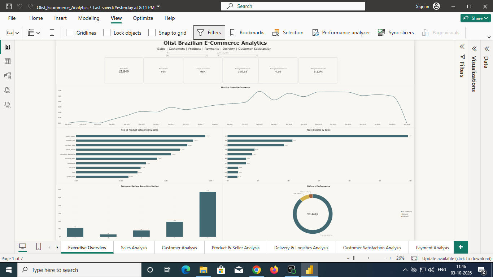

#### Sales Analysis

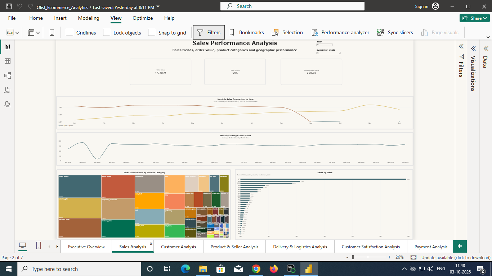

#### Customer Analysis

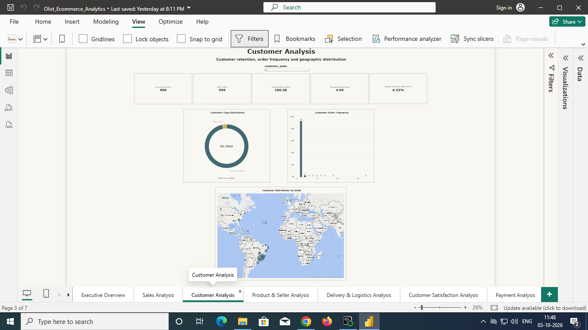

#### Product & Seller Analysis

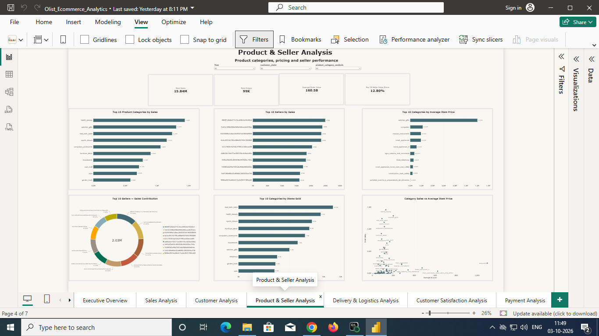

#### Delivery & Logistics Analysis

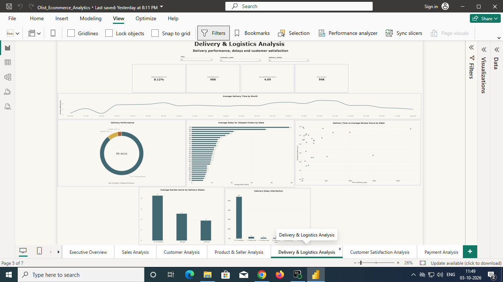

#### Customer Satisfaction Analysis

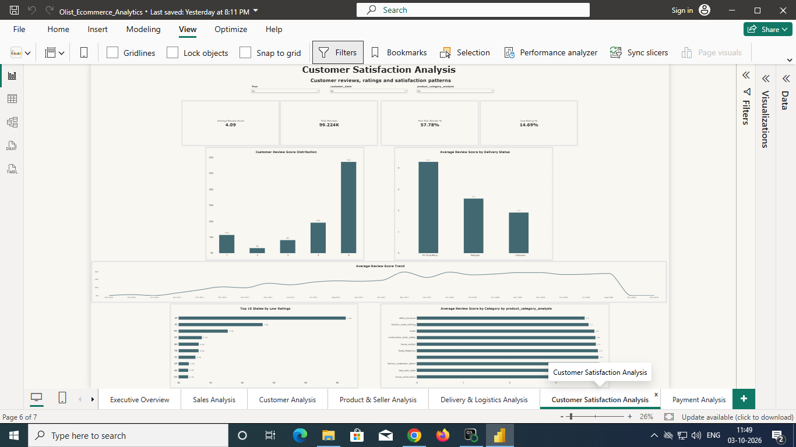

#### Payment Analysis

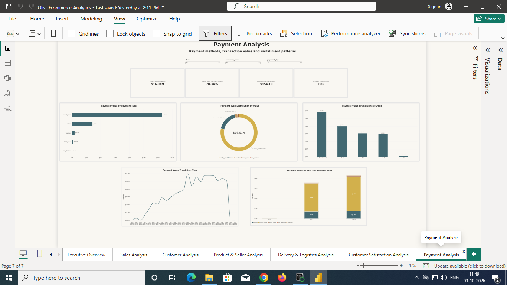

---

## 📗 Excel Analysis

Excel was used for data validation, business analysis, PivotTable-based exploration, and dashboard development.

The Excel workbook includes analysis covering:

- Sales performance
- Customer analysis
- Seller analysis
- Delivery performance
- Payment analysis
- Review and customer satisfaction
- PivotTable-based business analysis
- Dashboard reporting

### Excel Dashboard

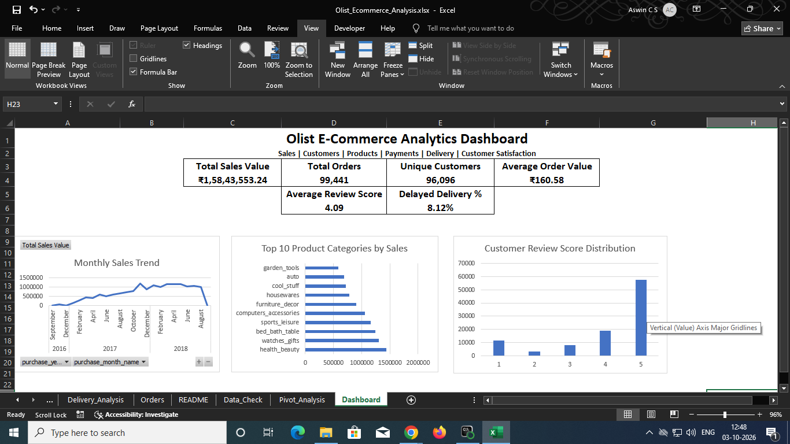

### Excel Sales Analysis

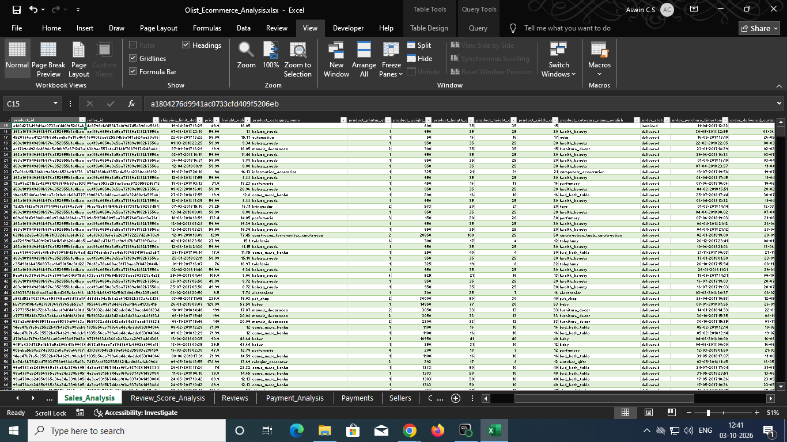

### Excel Customer Summary

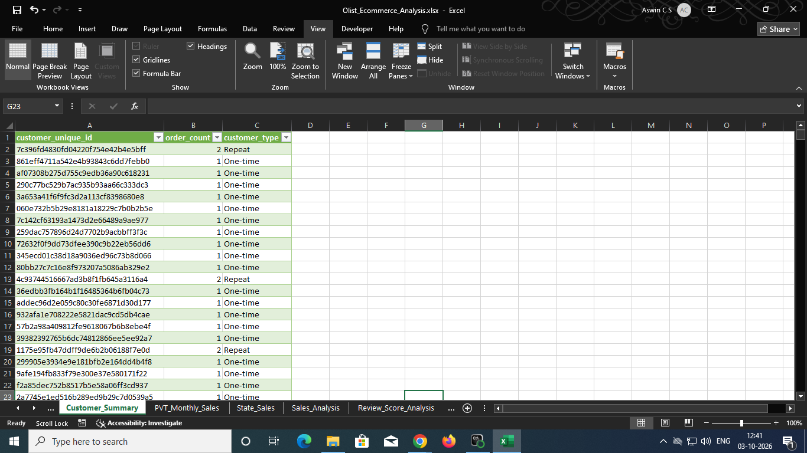

### Excel Seller Analysis

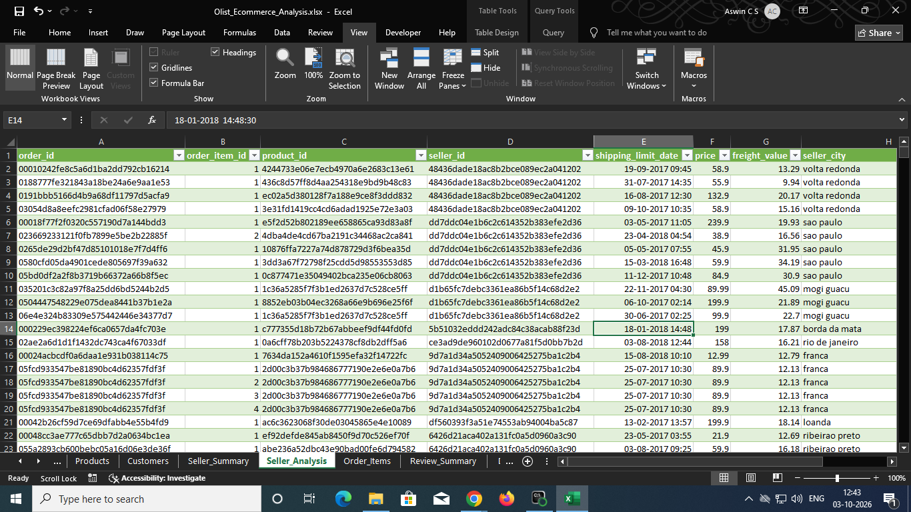

### Excel Delivery Analysis

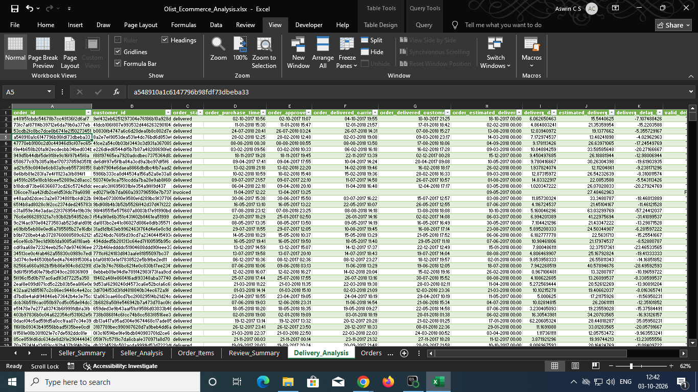

### Excel Payment Analysis

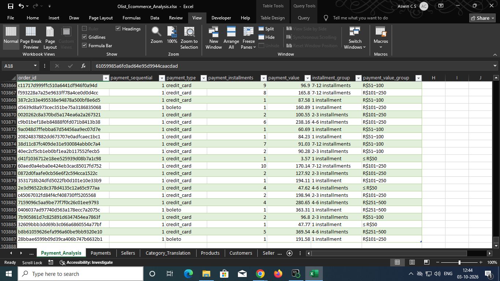

### Excel Pivot Analysis

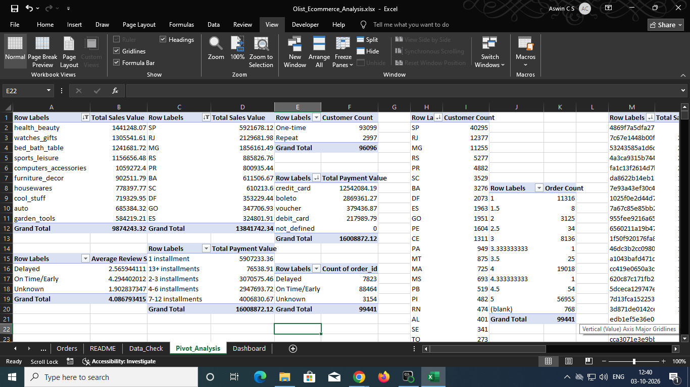

---

## 📁 Repository Structure

```text
Olist-Brazilian-Ecommerce-Analytics/
│
├── README.md
├── .gitignore
│
├── data/
│   └── dataset_information.txt
│
├── notebooks/
│   └── 01_olist_data_profiling.ipynb
│
├── sql/
│   ├── 01_data_validation.sql
│   ├── 02_sales_analysis.sql
│   ├── 03_customer_analysis.sql
│   ├── 04_seller_analysis.sql
│   ├── 05_delivery_analysis.sql
│   ├── 06_category_analysis.sql
│   └── 07_payment_analysis.sql
│
├── report/
│   └── Olist_Brazilian_Ecommerce_Analytics_Report.docx
│
└── screenshots/
    ├── customer_analysis.png
    ├── customer_satisfaction.png
    ├── delivery_analysis.png
    ├── executive_overview.png
    ├── payment_analysis.png
    ├── product_seller_analysis.png
    ├── sales_analysis.png
    ├── excel_customer_summary.png
    ├── excel_dashboard.png
    ├── excel_delivery_analysis.png
    ├── excel_payment_analysis.png
    ├── excel_pivot_analysis.png
    ├── excel_sales_analysis.png
    └── excel_seller_analysis.png
```

---

## 📂 Project Files

### 🐍 Python

[`01_olist_data_profiling.ipynb`](notebooks/01_olist_data_profiling.ipynb)

Contains the initial data profiling, data quality assessment, cleaning, feature preparation, and exploratory analysis.

### 🗄️ SQL

The [`sql`](sql/) folder contains PostgreSQL analysis covering:

- Data validation
- Sales analysis
- Customer analysis
- Seller analysis
- Delivery analysis
- Category analysis
- Payment analysis

### 📄 Project Report

[`Olist_Brazilian_Ecommerce_Analytics_Report.docx`](report/Olist_Brazilian_Ecommerce_Analytics_Report.docx)

Contains the detailed project methodology, findings, business insights, recommendations, limitations, and KPI reference.

---

## 🔍 Data Quality & Methodology

The project includes data-quality checks covering:

- Missing values
- Duplicate records
- Referential consistency
- Multiple payment records per order
- Multiple review records per order
- Delivery-date anomalies
- Product category translation coverage

The analysis uses descriptive and diagnostic methods. Observed relationships are not automatically interpreted as causal relationships.

---

## ⚠️ Data & File Availability

The original Olist datasets are not included in this repository.

The completed Excel workbook and Power BI `.pbix` file are maintained separately because of GitHub file-size limitations.

Dashboard screenshots are included to demonstrate the Power BI and Excel analysis and visualization work.

---

## 👤 Author

**Aswin C S**

M.Sc. Statistics | Data Analytics & Data Science
